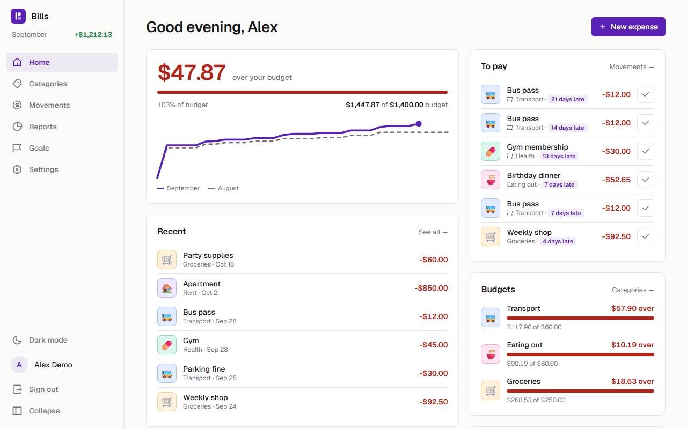
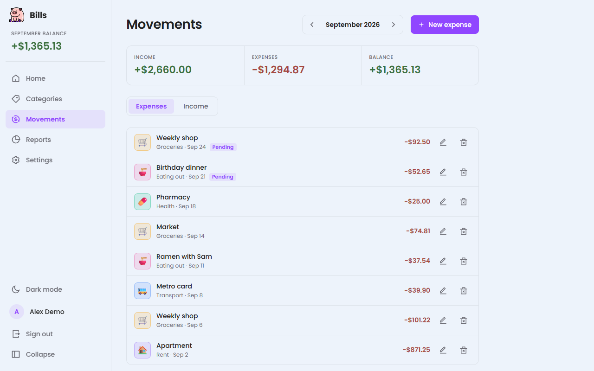
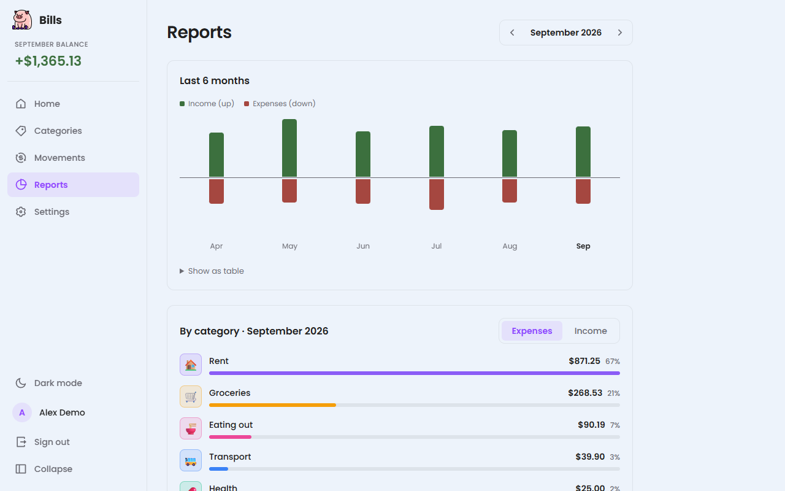
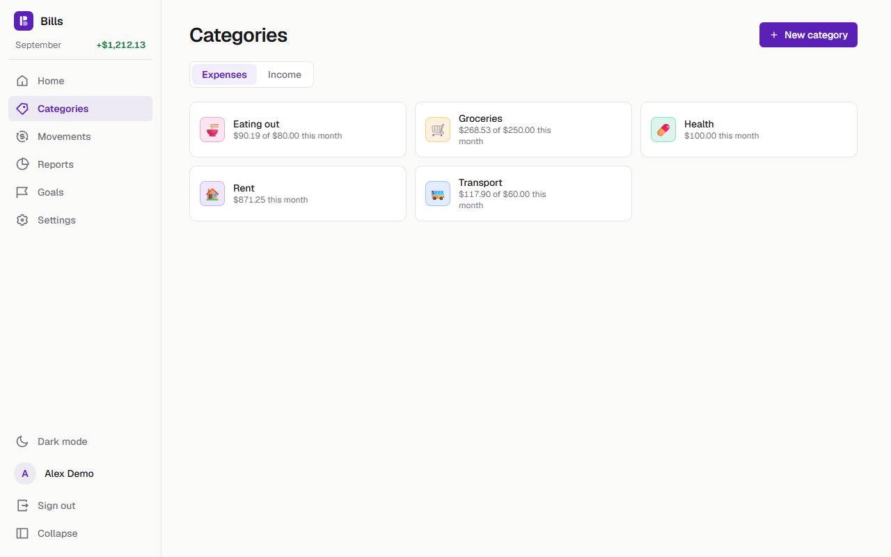
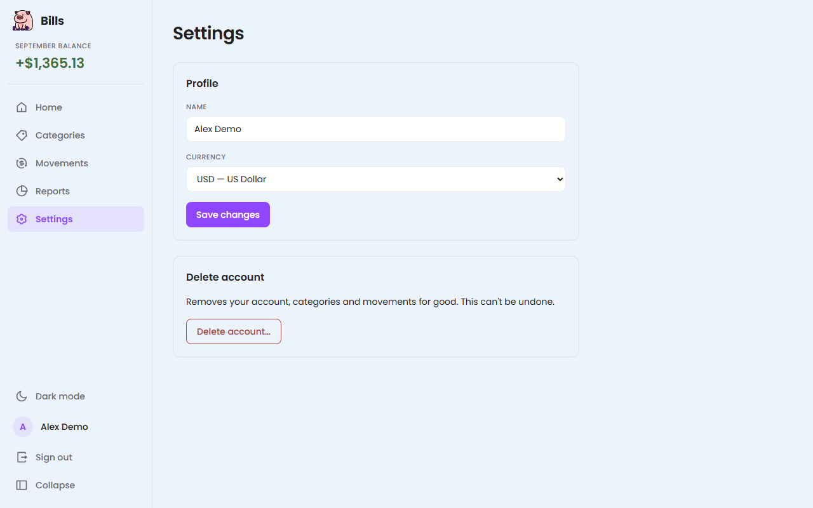
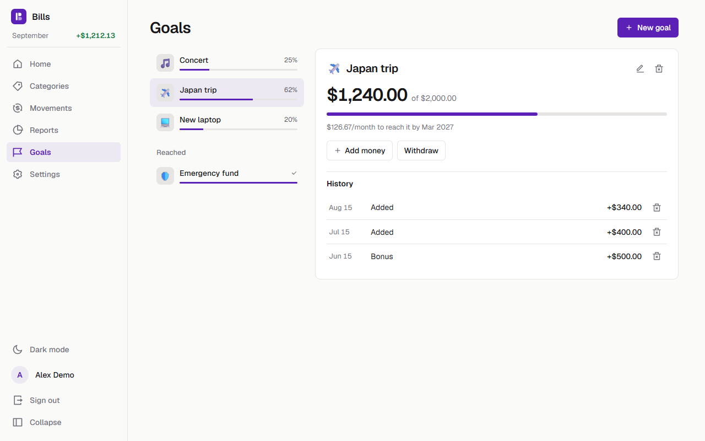
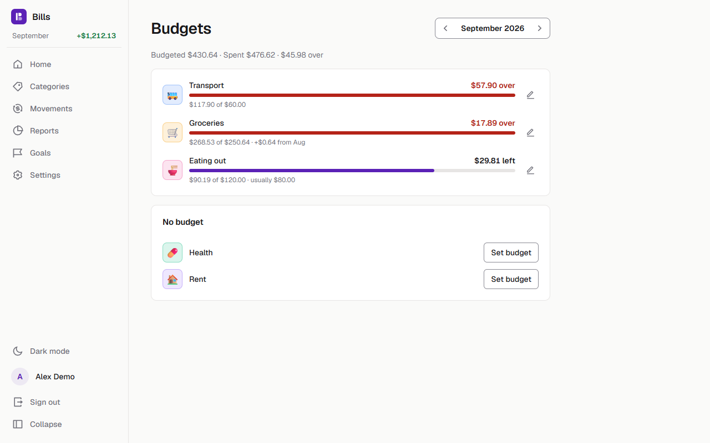
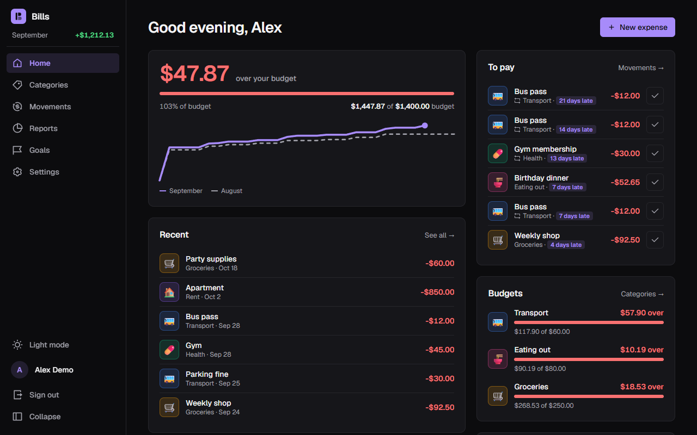
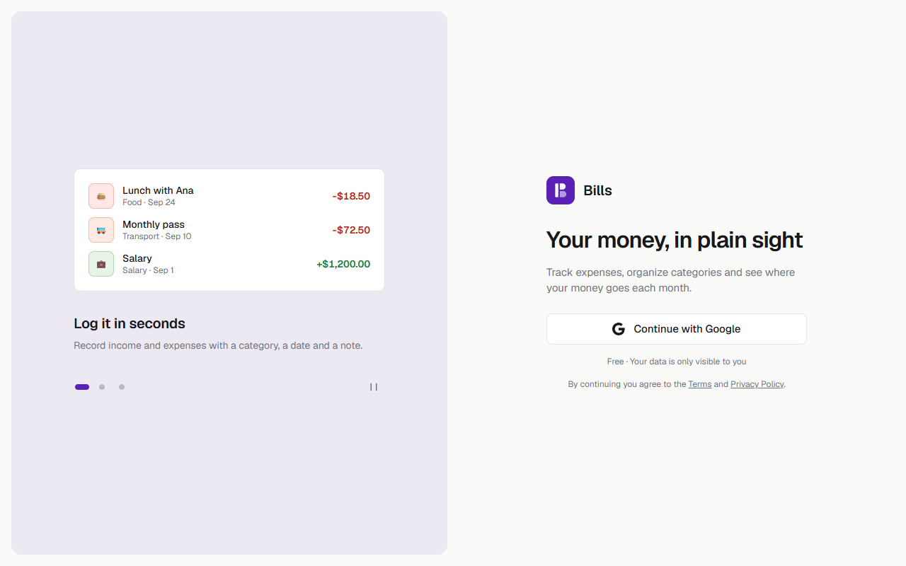

# Bills

A personal expense tracker: sign in with Google, organize your categories, log income and expenses, and see where your money goes each month.

**Live:** https://web-app-bills.vercel.app · **Version:** 1.0.1 — see the [changelog](CHANGELOG.md)



| Movements | Reports |
|---|---|
|  |  |
| **Categories** | **Settings** |
|  |  |
| **Goals** | |
|  |  |

<details>
<summary>Dark theme</summary>



</details>

<details>
<summary>Sign in</summary>



</details>

<sub>Screenshots use demo data.</sub>

## Features

- **Google sign-in** via Supabase Auth. Each account only sees its own data (Postgres row-level security).
- **Home**: what's left of this month's budget (or income), this month's spending vs. last month day by day, recent movements, what's still **to pay** with due dates (settle it in one click), budgets, top categories and active goals.
- **Categories** for income and expenses, with emoji, color and this month's total.
- **Budgets** per expense category: a monthly cap, one-month exceptions (a bigger December) and an optional rollover of last month's leftover or overspend, planned month by month on the Budgets page.
- **Movements** by month: amount, category, date, description, paid/pending. Monthly totals, search and filters (text, category, status, amount, all months), **CSV export** of what you see and **CSV import** of an export (preview, new categories, duplicates left unchecked).
- **Recurring movements**: weekly, monthly or yearly rules that add pending movements when they're due; pause, resume or delete them in Settings.
- **Savings goals**: a target, an optional deadline with the monthly pace to reach it, and a history of contributions and withdrawals.
- **Reports**: 6-month income vs. expense trend and a ranked breakdown by category with month-over-month changes, each with an accessible table view.
- **Settings**: display name, currency (formats every amount), total monthly budget, recurring movements and self-service account deletion.
- **Installable** as an app (web manifest).
- **Appearance**: Light, Dark or System (follows the OS live); light/dark choices sync across devices.
- **Motion** that respects the OS "reduce motion" setting: figures count, charts draw, lists and pages transition.
- Responsive: sidebar on desktop, bottom bar on mobile.

## Stack

| Layer | Tech |
|---|---|
| UI | React 19, Vite, react-router 7, styled-components 6, motion, react-icons, Geist |
| State | TanStack Query (server data), Zustand (session, theme, selected month) |
| Backend | Supabase: Auth (Google OAuth) + PostgreSQL with RLS |
| Hosting | Vercel (static SPA) + Supabase free tier |

Charts are plain SVG/CSS and the login carousel uses CSS scroll-snap — no chart or carousel libraries. Animations use `motion`.

## Run locally

Requirements: Node 20+ and a Supabase project.

```bash
git clone https://github.com/RicketyMajor/web-app-bills.git
cd web-app-bills
npm install
cp .env.example .env.local   # then fill in the two values
npm run dev                  # http://localhost:5173
```

### Environment variables

| Variable | Value |
|---|---|
| `VITE_SUPABASE_URL` | Project URL, e.g. `https://<ref>.supabase.co` (the origin — not the `/rest/v1/` URL) |
| `VITE_SUPABASE_ANON_KEY` | Project anon (public) key |

Only the anon key belongs in the client; the data is protected by RLS. Never use the `service_role` key here.

### Database

Run the files in `supabase/migrations/` in order in the Supabase SQL Editor. `20260925000000_init_schema.sql` creates:

- `profiles` — one row per user, created by a trigger on sign-up (which also seeds 6 default categories).
- `categories` — `name`, `type` (`income` | `expense`), `icon` (emoji), `color`.
- `movements` — `amount`, `date`, `description`, `paid`, linked to a category. The type comes from the category.

Every table has a `user_id` and RLS policies limiting access to `auth.uid()`.

`20260927000000_settings.sql` makes `profiles.theme` nullable (null = follow the OS) and adds `delete_account()`, a `security definer` function that deletes the caller's auth user (cascading to their data).

`20260928000000_category_constraints.sql` makes category names unique per user and type regardless of case, and bounds the icon length.

`20260928100000_budgets.sql` adds an optional monthly budget per expense category and a total on the profile.

`20260928200000_recurring.sql` adds `recurring` rules and links their movements with `movements.recurring_id`.

`20260929000000_goals.sql` adds `goals` and `goal_contributions` (signed amounts; saved = their sum).

`20260929100000_budget_months.sql` adds `categories.rollover` and `budget_overrides` (one budget for one category and month).

### Google sign-in

1. Google Cloud → Credentials → OAuth client (Web): add `http://localhost:5173` to *Authorized JavaScript origins* and `https://<ref>.supabase.co/auth/v1/callback` to *Authorized redirect URIs*.
2. Supabase → Authentication → Providers → Google: paste the client ID and secret.
3. Supabase → Authentication → URL Configuration: add `http://localhost:5173/**` to *Redirect URLs*.

The dev server must run on port 5173 to match these settings.

## Scripts

| Command | What it does |
|---|---|
| `npm run dev` | Dev server on port 5173 |
| `npm test` | Unit tests (`node:test`, `src/**/*.test.js`) |
| `npm run lint` | ESLint |
| `npm run build` | Production build to `dist/` |
| `npm run preview` | Serve the production build |

## Deploy (Vercel)

1. Import the repo in Vercel with the **Vite** preset.
2. Add `VITE_SUPABASE_URL` and `VITE_SUPABASE_ANON_KEY` as environment variables.
3. Add the production URL to Supabase *Site URL* / *Redirect URLs* (`https://<app>.vercel.app/**`) and to Google *Authorized JavaScript origins*.

`vercel.json` rewrites every path to `index.html` so deep links like `/reports` work on reload. Pushes to `main` deploy automatically.

## Project structure

```
src/
  components/
    atoms/ molecules/ organisms/ templates/   # atomic design
  pages/        # one thin wrapper per route (lazy-loaded)
  routers/      # routes + auth guards
  hooks/        # TanStack Query hooks (categories, movements, totals, reports, profile, recurring, goals)
  store/        # Zustand stores (auth, theme, month)
  supabase/     # Supabase client
  styles/       # themes, design tokens, global styles
  utils/        # money/date helpers and aggregations (+ tests)
supabase/migrations/   # database schema
```

## Legal

[Privacy Policy](https://web-app-bills.vercel.app/privacy) · [Terms of Service](https://web-app-bills.vercel.app/terms)

## Author

Alonso Vera ([Rickety Major](https://github.com/RicketyMajor))
